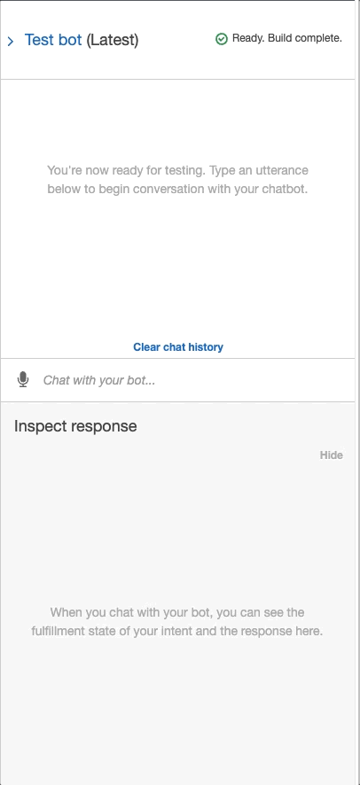
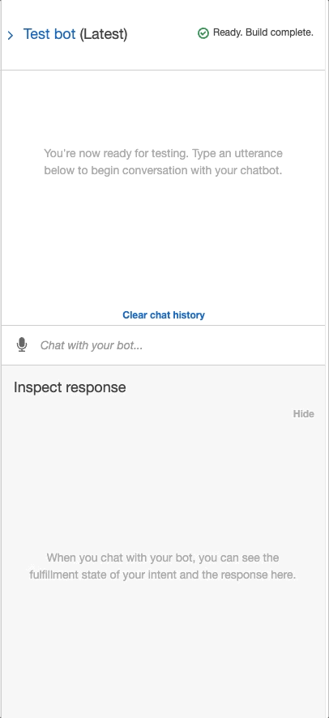

# AWS Lex Robo Advisor

## Description

This project uses AWS Lex and Lambda. I created a Lex Bot that will give recommendations to a user based on their inputs. The Lex Bot uses Lambda to check against constraints.

The general criteria for the bot is seen below:
  + Bot name: RoboAdvisor
  + Language: English (US)
  + Output voice: Salli
  + Session timeout: 5 Minutes
  + Sentiment analysis: No
  + COPPA: No
  + Advanced Options: No
  + All other options: Default values

Our intents are defined below:
  + Utterances
    + I want to save money for my retirement
    + I'm {age} and I would like to invest for my retirement
    + I'm ​{age} and I want to invest for my retirement
    + I want the best option to invest for my retirement
    + I'm worried about my retirement
    + I want to invest for my retirement
    + I would like to invest for my retirement

  + Slots
    + firstName (AMAZON.US_FIRST_NAME)
    + age (AMAZON.NUMBER)
    + investmentAmount (AMAZON.NUMBER)
    + riskLevel (AMAZON.AlphaNumeric)

Once everything has been defined, we can test our bot using only Lex. The GIF is seen below:

Now that we've seen that the bot works, we have to use Lambda to control our constraints. The constraints are as follows:
  + 0 >= age <=65
  + investmentAmount >= 5000

With the Lamda function tested and complete, we integrate it into Lex. We can see the new Lex GIF below:

We are able to see that the bot is fully funcitonal. When the user tries to enter an age outside of constraints, the bot asks for the age again. When the user enters an investment amount less than the constraint, it asks the user for a larger investment. The outcome is that the user, based on their aggressiveness level, is given a recommendation about how to invest their capital.

## Table of Contents

- [AWS Lex Robo Advisor](#aws-lex-robo-advisor)
  - [Description](#description)
  - [Table of Contents](#table-of-contents)
  - [1. Installation](#1-installation)
  - [2. Usage](#2-usage)
  - [3. License](#3-license)
  - [4. Contributing](#4-contributing)
  - [5. Tests](#5-tests)
  - [6. Deployment](#6-deployment)
  - [7. Contact](#7-contact)

## 1. Installation

  If you would like to clone the repository, type "git clone https://github.com/kheller18/aws-lex-robo-advisor.git".

  The following is used in this repository:
  + [AWS Lex (V1)](https://aws.amazon.com/lex/) - NLP Chatbot
  + [AWS Lambda](https://aws.amazon.com/lambda/) - Business logic extension to Lex bot

## 2. Usage

  After cloning the repository locally, you'll need to have the packages listed in [Installation](#1-installation) installed on your machine.

## 3. License

GNU GENERAL PUBLIC LICENSE
Version 3, 29 June 2007

Copyright (C) 2007 Free Software Foundation, Inc. <https://fsf.org/>
Everyone is permitted to copy and distribute verbatim copies
of this license document, but changing it is not allowed.

## 4. Contributing

  + [Keenan Heller](https://github.com/kheller18)

## 5. Tests

  + There are four tests associated with this repository. They can be found in the "Test_Events" directory.
    + ageError
    + correctDialog
    + incorrectAmountError
    + negativeAgeError

## 6. Deployment

  + There is currently no live deployment of this notebook on a common server, but it can be configured using AWS Lex and Lambda.

## 7. Contact

  + [Keenan's LinkedIn](https://www.linkedin.com/in/keenanheller/)